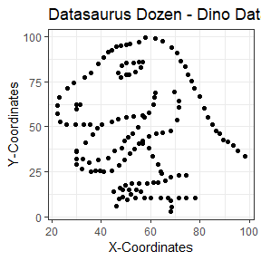
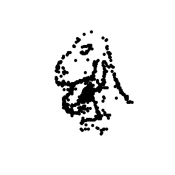

## Introduction

2D probabilistic diffusion models are a class of generative models used to synthesize images or other 2D data. These models work by defining a forward diffusion process, which gradually adds noise to data, and a reverse process that learns to denoise and recover the original data from the noisy observations. The forward process is often designed as a simple Gaussian noise addition over several time steps, while the reverse process is modeled using deep neural networks, typically U-Nets or similar architectures.

#### Key Concepts:

- **Forward Process:** A sequence of steps where noise is incrementally added to the data, making it increasingly difficult to discern the original content.
- **Reverse Process:** A trained neural network that learns to progressively denoise the data, essentially reversing the forward process to generate clear images from noise.

### Steps to Fitting 2D Probabilistic Diffusion Models

1. **Define the Forward Process:**
   - Establish a noise schedule, usually by defining a set of Gaussian noise distributions that will be added to the data over time.
   - This process gradually transforms the data into pure noise over several steps.

2. **Parameterize the Reverse Process:**
   - Design a neural network (e.g., a U-Net) to model the reverse diffusion steps.
   - The network's task is to predict the mean and variance of the reverse Gaussian distributions at each step.

3. **Training Objective:**
   - The model is trained using a loss function that typically involves a combination of mean squared error (MSE) between the predicted and true denoised data, and a KL divergence term that ensures the predicted noise matches the distribution of the added noise.
   - The model learns to map noisy data back to the original data distribution.

4. **Sampling:**
   - Once trained, the model can generate new data by starting with pure noise and applying the learned reverse diffusion process iteratively to generate a clear image.

### Context of More Complicated Models like DALL-E

DALL-E and similar models (e.g., DALL-E 2, Imagen) extend the concept of diffusion models into more complex domains, such as text-to-image synthesis. They combine large-scale transformer models with diffusion processes, enabling the generation of high-quality images from textual descriptions. These models typically use more sophisticated conditioning mechanisms to align text and image representations and leverage massive amounts of data for training. This vignette demonstrates how to implement a minimal 2D probabilistic diffusion model using the `scorcher` package in R. We will use the [Datasaurus Dozen](https://github.com/albertocornago/datasaurus) dataset, which contains twelve datasets with identical summary statistics but distinct distributions and appearances. The goal is to showcase how probabilistic diffusion can be applied to one of these datasets (the 'dino') to capture and generate similar data distributions. This vignette is based on [Tanel Parnamaa's](https://tanelp.github.io/) ['tiny-diffusion'](https://github.com/tanelp/tiny-diffusion). It provides an interesting, but slightly more complicated, deep learning task to highlight the potential of the `scorcher` package.

<br>

## Setup

### Installing and Loading Required Packages

Before we begin, ensure that you have the necessary packages installed. You can install them using the following commands:


``` r
install.packages("tidyverse")
install.packages("datasauRus")
install.packages("torch")
install.packages("scorcher")
```

Additionally, you'll need to install torch dependencies. Follow the instructions provided [here](https://torch.mlverse.org/start/installation/) to install torch. Then, you can load the `scorcher` library and the other necessary libraries for this analysis with:


``` r
library(tidyverse)
library(datasauRus)
library(torch)
library(scorcher)
```

### Loading the Data

We start by loading and preprocession the Datasaurus Dozen dataset.


``` r
# Load the datasaurus_dozen dataset

data("datasaurus_dozen")

# Filter for a specific dataset (i.e., "dino"), sample points, noise, and scale

nobs <- 8000

set.seed(123)

dino_data <- datasaurus_dozen |> 
  
  filter(dataset == "dino") |>
  select(-dataset) |>
  sample_n(nobs, replace = T) |>
  mutate(
    x = ((x + rnorm(nobs, sd = 0.15)) / 54 - 1) * 4,
    y = ((y + rnorm(nobs, sd = 0.15)) / 48 - 1) * 4) |>
  as.matrix()
```

## Visualizing the Data

Let's visualize the 'dino' data.


``` r
# Visualize the dino dataset

datasaurus_dozen |>
  filter(dataset == "dino") |>
  ggplot(aes(x = x, y = y)) +
    theme_bw() +
    geom_point() +
    labs(title = "Datasaurus Dozen - Dino Dataset",
         x = "X-Coordinates", y = "Y-Coordinates")
```

<!-- -->


## Using Scorcher

### Defining the Neural Network

Next, we'll define our 2D probabilistic diffusion model using the `scorcher` package. As before, we start by creating the dataloader using the `scorch_create_dataloader` function and defining the neural network architecture using the `initiate_scorch` and `scorch_layer` functions. For the purposes of this example, we also add a residual connection block with linear and Gaussian error linear unit (GeLU) activations. Note that for our input layer, we set the number of nodes to be three times our chosen number of nodes, as we will be concatenating a positional embedding for the two dimensions of the data and one for the timesteps. Our output layer has two nodes, one for each output data dimension. We have three hidden MLP blocks, each with 128 nodes.


``` r
# Create the dataloader

input <- output <- torch_tensor(dino_data, dtype = torch_float())

dl <-scorch_create_dataloader(input, output, batch_size = 32)

# Define the neural network

scorch_model <- dl |> 
  initiate_scorch() |> 
  scorch_layer("linear", 128 * 3, 128) |>
  scorch_layer("gelu") |>
  scorch_layer(c("linear", "gelu"), 128, 128, use_residual = TRUE) |>
  scorch_layer(c("linear", "gelu"), 128, 128, use_residual = TRUE) |>
  scorch_layer(c("linear", "gelu"), 128, 128, use_residual = TRUE) |>
  scorch_layer(c("linear", "gelu"), 128, 128, use_residual = TRUE) |>
  scorch_layer("linear", 128, 2)

```

As opposed to the examples in the `palmer-penguins` and `mnist` vignettes, in this example we require additional arguments to `compile_scorch` and `fit_scorch` to build and train the model. For `compile_scorch`, we have two arguments, `init_fn` and `forward_fn` which take functions for context-specific data preprocessing during the model building. The `init_fn` argument takes a function that modifies the underlying `initialize` method for the torch neural network, which is used to set up the model's layers and parameters. When you define a neural network, this is where you specify what layers the network will have (e.g., linear layers, convolutional layers) and their configurations (e.g., number of units, activation functions). In this example, we need to add positional embeddings for each dimension of the data, as well as the time steps. We do this with a function we have provided, `scorch_2d_diffusion_init`, that takes an additional argument, `scale`.

Similarly, the `forward_fn` argument takes a function that modifies the underlying `forward` method for the torch neural network. The `forward` method defines the forward pass of the network, specifying how the input data moves through the layers of the model to produce an output. This is where you define the sequence of operations and the transformations applied to the input data. Here, we must apply the embeddings defined in the `initialize` method to our data and then concatenate the different dimension of the data and the timesteps to form one input for the neural network. We do this with the provided `scorch_2d_diffusion_forward` function.


``` r
# Compile the neural network

compiled_scorch_model <- scorch_model |>
  
  compile_scorch(init_fn = scorch_2d_diffusion_init, 
    
    forward_fn = scorch_2d_diffusion_forward, scale = 25)

```

### Defining the Noise Scheduler

We must also create a noise scheduler by defining a set of Gaussian noise distributions that will be added to the data over time. We do this using the included `NoiseScheduler` function, which we transcribed from the ['tiny-diffusion'](https://github.com/tanelp/tiny-diffusion) implementation in PyTorch. We establish 50 timesteps for this example.


``` r
# Define the noise scheduler

noise_scheduler <- NoiseScheduler$new(
  num_timesteps = 50L,
  beta_schedule = "linear"
)
```

### Training the Diffusion Model

We will then fit our simple diffusion model using `fit_scorch`. This model will involve the neural network we defined above to learn to reverse the diffusion process. As with `compile_scorch`, the `fit_scorch` function has an optional argument, `preprocess_fn`, that takes a function to define additional steps in the training procedure. Here, we implement the function `scorch_2d_diffusion_train`, which defines the timesteps and adds noise to the data. This function takes a data 'batch' as input, as well as the noise scheduler, which is passed as an additional argument to `fit_scorch`.


``` r
# Train the model

fitted_scorch_model <- compiled_scorch_model |> 
  
  fit_scorch(loss = nn_mse_loss, optim = optim_adamw, num_epochs = 50,
             
    verbose = F, preprocess_fn = scorch_2d_diffusion_train, 
    
    clip_grad = "norm", clip_params = list(max_norm = 1),
    
    noise_scheduler = noise_scheduler)
#> No GPU detected. Using available CPU.
```

## Generating a New Image from Noise

Once the model is trained, we can use it to generate new data points to resemble the original 'dino' data from a completely random sample. We illustrate how the reverse process recovers the distribution of the training data after 50 epochs.


``` r

fitted_scorch_model$eval()

sample <- torch_randn(1000L, 2)

timesteps <- rev(seq_len(length(noise_scheduler)))
      
for (t in timesteps) {
      
  t_tensor <- torch_tensor(rep(t, 1000L), dtype = torch_long())
      
  with_no_grad({
        
    residual <- fitted_scorch_model(sample, t_tensor)
  })
      
  sample <- noise_scheduler$step(residual, t, sample)
}
      
frame <- as_array(sample)

xmin <- -6
xmax <- 6
ymin <- -6
ymax <- 6

ggplot() +
    geom_point(aes(x = frame[, 1], y = frame[, 2])) +
    xlim(xmin, xmax) +
    ylim(ymin, ymax) +
    theme_void()
```

<!-- -->


## Conclusion

This vignette provided a brief introduction to implementing a 2D probabilistic diffusion model using the `scorcher` package. We used the Datasaurus Dozen dataset to showcase how such a model can learn to replicate complex data distributions. Further experimentation and tuning can lead to more refined models capable of generating data with specific properties. We greatly appreciate and credit [Tanel Parnamaa's](https://tanelp.github.io/) ['tiny-diffusion'](https://github.com/tanelp/tiny-diffusion) example, which we based this vignette on.

## References

- [tiny-diffusion](https://github.com/tanelp/tiny-diffusion)
- [Datasaurus Dozen](https://github.com/albertocornago/datasaurus)
- [torch for R](https://torch.mlverse.org/)
