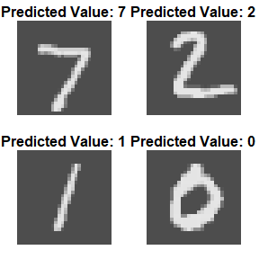

## Introduction

This vignette demonstrates how to use the `scorcher` package to fit a convolutional neural network using the [MNIST](https://github.com/mlverse/torchvision/blob/main/R/dataset-mnist.R) dataset, which consists of handwritten digits from 0 to 9. The MNIST dataset included in the [torchvision](https://torchvision.mlverse.org/) package contains 70,000 grayscale images of handwritten digits, each 28x28 pixels in size. It is divided into 60,000 training images and 10,000 testing images. The goal is to classify these images into one of the 10 digit categories (0-9). In this vignette, we will preprocess the data, create a neural network model, and evaluate its performance.

<br>

## Setup

### Installing and Loading Required Packages

Before we begin, ensure that you have the necessary packages installed. You can install them using the following commands:


``` r
install.packages("torch")
install.packages("torchvision")
install.packages("scorcher")
```

Additionally, you'll need to install torch dependencies. Follow the instructions provided [here](https://torch.mlverse.org/start/installation/) to install torch. Then, you can load the `scorcher` library and the other necessary libraries for this analysis with:


``` r
library(torch)
library(torchvision)
library(scorcher)
```

### Loading the Data

We'll now load the MNIST dataset and preprocess it for training and testing:


``` r
# Training data

train_data <- mnist_dataset(
  root = tempdir(),
  download = TRUE,
  transform = transform_to_tensor
)

x_train <- torch_tensor(train_data$data, dtype = torch_float()) |> 
  torch_unsqueeze(2)

y_train <- torch_tensor(train_data$targets, dtype = torch_long())

```

### Visualizing the Data

Let's visualize some samples from the training dataset.


``` r
# Visualizing the MNIST training data

par(mfrow = c(2, 2), mar = c(1, 1, 1, 1), pty = "s")

for (i in 1:4) {
  img <- x_train[i, , drop = F] |> as.array() |> matrix(nrow = 28)
  image(t(img[nrow(img):1, ]), axes = F, col = gray.colors(256))
}
```

<!-- -->

## Using Scorcher

### Defining the Neural Network

Next, we'll define our neural network using the `scorcher` package.


``` r
# Create the dataloader

dl <- scorch_create_dataloader(x_train, y_train, batch_size = 500)

# Define the neural network

scorch_model <- dl |> 
  initiate_scorch() |> 
  scorch_layer("conv2d", in_channels = 1, out_channels = 32, kernel_size = 3) |> 
  scorch_layer("relu") |>
  scorch_layer("conv2d", in_channels = 32, out_channels = 64, kernel_size = 3) |> 
  scorch_layer("relu") |>
  scorch_layer("max_pool2d", kernel_size = 2) |> 
  scorch_layer("dropout2d", p = 0.25) |>
  scorch_function(torch_flatten, start_dim = 2) |> 
  scorch_layer("linear", 9216, 128) |>
  scorch_layer("relu") |> 
  scorch_layer("linear", 128, 10)
  
# Compile the neural network

compiled_scorch_model <- scorch_model |>
  compile_scorch()
```

### Training the Neural Network

We'll train our neural network on the training data.


``` r
fitted_scorch_model <- compiled_scorch_model |> 
  fit_scorch(loss=nn_cross_entropy_loss, num_epochs = 10, verbose = F)
#> No GPU detected. Using available CPU.
```

### Evaluating the Model

Finally, we'll evaluate our model on the test data.


``` r
# Testing data

test_data <- mnist_dataset(
  root = tempdir(),
  train = FALSE,
  transform = transform_to_tensor
)

x_test <- torch_tensor(test_data$data, dtype = torch_float()) |> 
  torch_unsqueeze(2)

y_test <- torch_tensor(test_data$targets, dtype = torch_long())

# Model predictions

fitted_scorch_model$eval()

output <- fitted_scorch_model(x_test)
pred <- torch_argmax(output, dim = 2)

accuracy <- sum(pred == y_test)$item() / length(y_test)
cat(sprintf("Test Accuracy: %.2f%%\n", accuracy * 100))
#> Test Accuracy: 98.56%
```

### Visualizing the Predictions 

We can also visualize our predictions:


``` r
# Visualizing some of the predictions

par(mfrow = c(2, 2), mar = c(1, 1, 1.5, 1), pty = "s")

with_no_grad({
  for (i in 1:4) {
    img <- x_test[i, , drop = F] |> as.array() 
    prediction <- fitted_scorch_model(
      torch_tensor(img, dtype = torch_float())) |> torch_argmax(dim = 2) - 1
    img_mat <- matrix(img, nrow = 28)
    image(t(img_mat[nrow(img_mat):1, ]), axes = F, col = gray.colors(256), 
      main = paste("Predicted Value:", prediction$item()))
  }
})
```

<!-- -->

## Conclusion

In this vignette, we successfully trained a neural network on the MNIST dataset using the `scorcher` package We demonstrated data preprocessing, model definition, training, and evaluation steps. With further tuning and experimentation, you can improve the model's performance and explore more complex architectures.

For more information on `torch`, visit the [torch documentation](https://torch.mlverse.org/).

## References

**MNIST dataset:**

+ Deng, L. (2012). The mnist database of handwritten digit images for machine learning research. IEEE Signal Processing Magazine, 29(6), 141–142.
