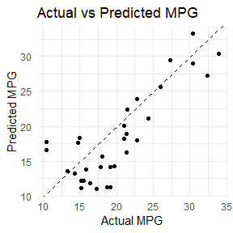

``` r
library(scorcher)
```

## Introduction

The `scorch_layer` function is a versatile tool for adding layers or residual blocks to a Scorch model architecture in `R`. It allows you to specify a variety of layer types and combine them in sequence, with an option to include residual connections. This vignette will guide you through the usage of `scorch_layer` with real-world data, demonstrating how to build and train models using the `mtcars` dataset.

## Prerequisites

Before using `scorch_layer`, ensure that you have the following packages installed and loaded:


``` r
library(scorcher)
library(torch)
library(tidyverse)
```

## Data Preparation: `mtcars` Dataset

For this vignette, we’ll use the `mtcars` dataset, which contains various car attributes such as miles per gallon (mpg), horsepower (hp), and weight (wt). We will build a simple neural network to predict `mpg` from `hp` and `wt`.


``` r
# Prepare the data

data(mtcars)

dat <- mtcars |>
  
  select(mpg, hp, wt) |>
  
  mutate(
    
    hp = scale(hp), 
    
    wt = scale(wt))

# Convert to torch tensors

x <- dat[, c("hp", "wt")] |>
  
  as.matrix() |> 
  
  torch_tensor(dtype = torch_float())

y <- torch_tensor(mtcars$mpg, dtype = torch_float())

y <- y$unsqueeze(2)
```

## Building a Simple Neural Network

Let's start by building a simple neural network using `scorch_layer` to predict `mpg` from `hp` and `wt`.


``` r

# Create the dataloader

dl <- scorch_create_dataloader(x, y, batch_size = 32)

# Initialize the Scorcher model

scorch_model <- dl |> 
  
  initiate_scorch()

# Add a hidden layer and output layer

scorch_model <- scorch_model |>
  
  scorch_layer(layer_type = "linear", in_features = 2, out_features = 16) |>
  
  scorch_layer(layer_type = "relu") |>
  
  scorch_layer(layer_type = "linear", in_features = 16, out_features = 1)

# View the model architecture

print(scorch_model)
#> This scorch model has a dataloader object with features: 
#> 
#> This is a dataloader object with features:
#>  * Batch size: 32
#>  * Number of batches: 1
#>  * Dimension of input tensors: 2
#>  * Dimension of output tensors: 1
#> 
#>  and model architecture:
#> 
#> * Layer 1 is a nn_linear layer
#> * Layer 2 is a nn_relu layer
#> * Layer 3 is a nn_linear layer
```

This network consists of:

- A hidden layer with 16 units and ReLU activation.
- An output layer with 1 unit (to predict `mpg`).

## Adding a Residual Block

Next, let's build a model with the above architecture and an added residual block. A residual connection is a technique where the input to a block of layers is added directly to the block's output. This creates a shortcut path, or "skip connection," that allows the original input to bypass one or more layers. Residual connections are beneficial for training deep networks because they help mitigate the vanishing gradient problem by allowing gradients to flow more easily through the network.


``` r

# Create and view updated model

scorch_model <- dl |> 
  
  initiate_scorch() |>
  
  scorch_layer(layer_type = c("linear", "relu"), 2, 16) |>
    
  scorch_layer(layer_type = c("linear", "relu"), 16, 16, use_residual = TRUE) |>
  
  scorch_layer(layer_type = "linear", 16, 1)

print(scorch_model)
#> This scorch model has a dataloader object with features: 
#> 
#> This is a dataloader object with features:
#>  * Batch size: 32
#>  * Number of batches: 1
#>  * Dimension of input tensors: 2
#>  * Dimension of output tensors: 1
#> 
#>  and model architecture:
#> 
#> * Layer 1 is a nn_linear layer
#> * Layer 2 is a nn_relu layer
#> * Layer 3 is a residual_block layer
#> * Layer 4 is a nn_linear layer
```

This model now includes:

- Two linear layers with ReLU activations.
- A residual connection that adds the input directly to the output of the block.

## Training the Model

Now that the model is built, we can train it using the `mtcars` data. We will 
use the Mean Squared Error (MSE) loss function and the Adam optimizer.


``` r

# Compile and fit the neural network

fitted_scorch_model <- scorch_model |>
  
  compile_scorch() |> 
  
  fit_scorch(num_epochs = 300, verbose = FALSE)
#> No GPU detected. Using available CPU.
```

## Evaluating the Model

After training, we can evaluate the model’s performance by comparing the predicted `mpg` values with the actual values.


``` r
# Make predictions

fitted_scorch_model$eval()

y_pred <- fitted_scorch_model(x) |> as_array()

# Plot the actual vs predicted mpg

plt_dat <- data.frame(actual = mtcars$mpg, predicted = y_pred)

ggplot(plt_dat, aes(x = actual, y = predicted)) +
  
  theme_minimal() +
  
  geom_point() +
  
  geom_abline(slope = 1, intercept = 0, linetype = 2, color = "black") +
  
  labs(
  
    title = "Actual vs Predicted MPG", 
    
    x = "Actual MPG", 
    
    y = "Predicted MPG")
```

<!-- -->

The plot shows how well the model's predictions align with the actual `mpg` values. A perfect model would have all points lying on the dashed line.

## Conclusion

The `scorch_layer` function simplifies the process of building complex neural network architectures in `R`. By providing a flexible way to define both simple layers and residual blocks, it allows you to experiment with different model configurations easily. This vignette has demonstrated how to use `scorch_layer` with real data, covering basic usage, residual connections, and model training.
